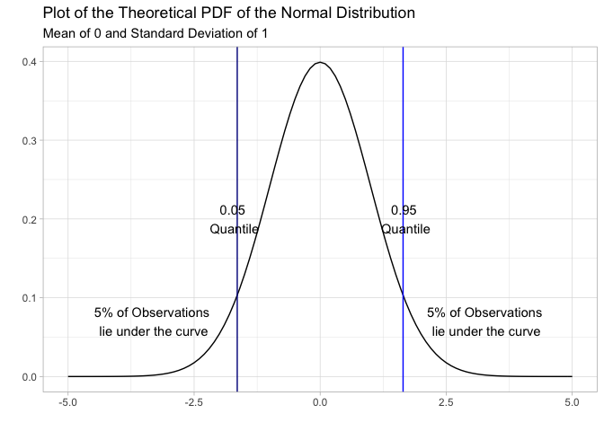
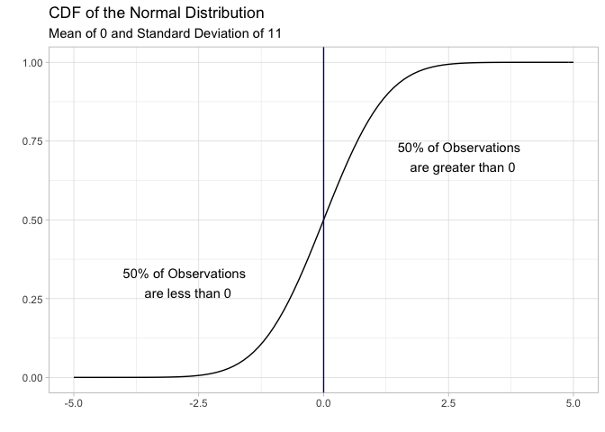
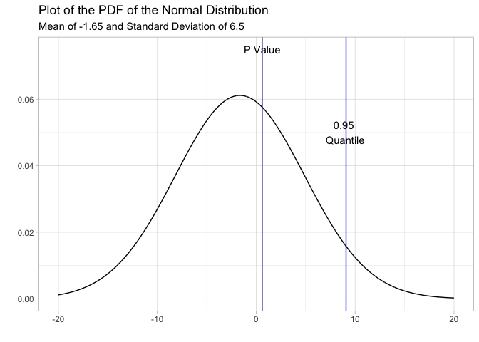

Statistical Signifcance and the Normal Distribution
================
Marie Fester
2019-03-25

Load the packages & datasets

``` r
# p_load is a function in the pacman package which installs a package if haven't already and 
# then calls it using the library() function
pacman::p_load(ggplot2, dplyr, wesanderson, ggfortify)

leaders <- read.csv("leaders.csv")
# Drop the first 14 empty columns
leaders <- leaders[(1:250), (15:28)]
```

Some new variables (same as in regression example)

``` r
leaders$success <- ifelse(leaders$result == "dies between a day and a week"| 
                                 leaders$result =="dies between a week and a month"| 
                                 leaders$result == "dies within a day after the attack"|
                                 leaders$result == "dies, timing unknown", 1, 0)

leaders <- mutate(leaders, diff = polityafter - politybefore)
```

The Normal Distribution
=======================

In this section I use the ggfortify package to plot the normal distribution. You will not need this package for your homework

This chunk shows a standard normal distribution. By the law of large numbers, the distribution of means will always be normal. We use standardized scores, like the z-score to overlay a non-normal distribution on the normal.

``` r
# The standard normal has a mean of 0 and a SD of 1
# The theoretical PDF is
ggdistribution(dnorm, seq(-5, 5, 0.1), mean = 0, sd = 1) + 
  geom_vline(xintercept = (qnorm(0.95, 0, 1)), colour = "blue") + 
  geom_vline(xintercept = (qnorm(0.05, 0, 1)), colour = "dark blue") + 
  labs(title = "Plot of the Theoretical PDF of the Normal Distribution",
       subtitle = "Mean of 0 and Standard Deviation of 1") +
  xlab("Value") +
  ylab("Probability of Value Occuring") + 
  theme_light() + 
  annotate("text", x = - 1.7, y = 0.2, label = "0.05 \nQuantile") + 
  annotate("text", x = 1.7, y = 0.2, label = "0.95 \nQuantile") +
  annotate("text", x = - 3.3, y = 0.07, 
           label = "5% of Observations \nlie under the curve") +
  annotate("text", x = 3.3, y = 0.07, 
           label = "5% of Observations \nlie under the curve")
```



``` r
# The Theretical CDF is
ggdistribution(pnorm, seq(-5, 5, 0.1), mean = 0, sd = 1) +
  labs(title = "CDF of the Normal Distribution", 
       subtitle = "Mean of 0 and Standard Deviation of 11") +
  xlab("Value of Normal Distribution") +
  ylab("Probability of Value Less Than or Equal to Occuring") +
  theme_light() + geom_vline(xintercept = 0, colour = "dark blue") +
  annotate("text", x = 2.75, y = 0.7, 
           label = "50% of Observations \n are greater than 0") +
  annotate("text", x = - 2.75, y = 0.3, 
           label = "50% of Observations \n are less than 0")
```



Using the Normal to for Statistical Significance
================================================

In this example I continue using the leaders dataset and our hypothesis that a successful leader assassination leads to higher polity scores. I start with a basic example of a confidence interval and p-value then apply these concepts to test the significance of the difference in means.

Confidence Intervals
--------------------

In this chunk I make a confidence interval around the polity score for all countries. We will test the mean against the hypothesis that mean polity scores are not 0. We will do a one tailed test at the 95% level.

What is a confidence interval (CI)? X-bar plus or minus (the standard deviation multiplied by the confidence level quantile).

``` r
# Step 1, find x bar (empircal mean)
xbar <- mean(leaders$polityafter, na.rm = TRUE)

# Step 2, find the standard deviation & standard error
sd <- sd(leaders$polityafter)
se <- sd/sqrt(nrow(leaders))

# Step 3, find the confidence level quantile
# input the confidence level, mean, and sd of the distribution, it will give you a number
quantile.value <- qnorm(0.95, 0, 1)

# Step 4, build your CI ~ don't forget to use standard error not standard deviation
lwr <- xbar - (quantile.value*se)
upr <- xbar + (quantile.value*se)

ci <- c(lwr, upr)
ci
```

    ## [1] -2.32886 -0.97114

Since the confidence interval does not contain zero, we reject the null hypothesis that the true mean is 0. Polity scores afterward decline by approximately 1-2.3 points (with 95% probability) after an assassination attempt.

P-Values
--------

In this chunk I find the p-value for the mean polity score for all countries. We will test the mean against the hypothesis that mean polity scores are 0 (the mean polity score if polity scores are uniformly distributed).

``` r
# Step 1, find the z score
# The z score is a standardized value which can be mapped onto the normal distribution
z.score <- (xbar - 0)/sd

# Step 2, get the p-value for the z score
# The p-value returns the area under the curve to the left (lower tail) of the z score
# Here I changed the defualt to return the upper tail
p.value <- pnorm(z.score, mean = 0, sd = 1, lower.tail = F)

# Side note, here's a visual of what we just did
ggdistribution(dnorm, seq(-20, 20, 0.01), mean = xbar, sd = sd) + 
  geom_vline(xintercept = (qnorm(0.95, xbar, sd)), colour = "blue") + 
  geom_vline(xintercept = (p.value), colour = "dark blue") +
  labs(title = "Plot of the PDF of the Normal Distribution",
       subtitle = "Mean of -1.65 and Standard Deviation of 6.5") +
  xlab("Value") + ylab("Probability of Value Occuring") +
  theme_light() + 
  annotate("text", x = p.value, y = 0.075, label = "P Value") + 
  annotate("text", x = 9, y = 0.05, label = "0.95 \nQuantile")
```



``` r
# Step 3, reject or do not reject the null hypothesis
# Here we want to find out whether the area to the left is less than or greater than
# 0.05 percent; if the p value is greater than 0.05 then we are less than 
# 95% confident in our estimate

ifelse(p.value > 0.05, "Do not reject the null", "Reject the Null")
```

    ## [1] "Do not reject the null"

Here we d not reject the null because the p value is very small (close to 0) which means that we cannot distinguish the mean from 0. This is confirmed by the ifelse statement: the p value is larger than 0.05, there is more area under the curve to the right of the p value line than the quantile line.

Applying this to difference in means
------------------------------------

Here I test the difference between the means of polity score before and after a successful assassination attempt. We are going to compare the mean DIM for the treated (successful assassination) and control groups.

### First prepare the data

Subset to only the treated and control groups; recall we already have the diff variable which is the difference between pre and post polity scores

``` r
treat <- subset(leaders, success == 1)
control <- subset(leaders, success == 0)

treat.mean <- mean(treat$diff, na.rm = T)
control.mean <- mean(control$diff, na.rm = T)

treat.sd <- sd(treat$diff, na.rm = T)
control.sd <- sd(control$diff, na.rm = T)

treat.se <- treat.sd/sqrt(nrow(treat))
control.se <- control.sd/sqrt(nrow(control))
```

### Confidence Interval

Here we are considering the two groups jointly so we need to compute their joint standard error.

``` r
# Joint standard error
joint.se <- sqrt((var(treat$diff)/nrow(treat)) + 
                   (var(control$diff)/nrow(control)))
# Difference in means
dim <- treat.mean - control.mean

# Find the quantile
q <- qnorm(0.95, 0, 1)

# Make the CI
lower <- dim - (joint.se*q)
upper <- dim + (joint.se*q)

ci <- c(lower, upper)
ci
```

    ## [1] -1.053693  1.239130

The 95% confidence interval contains 0, therefore we cannot reject the null. The difference in polity scores before and after leader assassination does not vary by treatment (success of assassination).

### P Value

``` r
# Get the z score
z.score.joint <- (dim - 0)/joint.se

# Find the p value
p.value.joint <- pnorm(z.score.joint, 0, 1, lower.tail = F)

# Check what's going on
ifelse(p.value.joint > 0.05, "Do not reject the null", "Reject the null")
```

    ## [1] "Do not reject the null"
