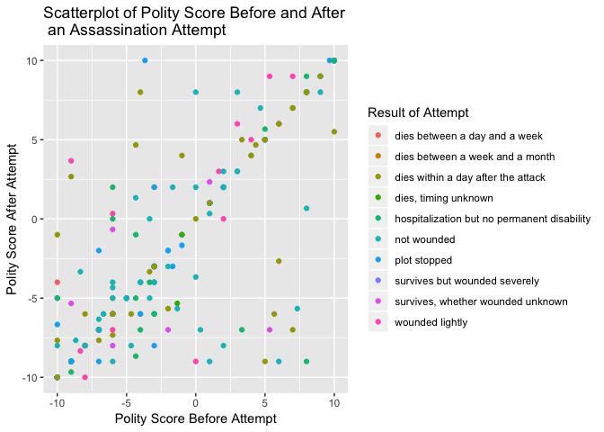
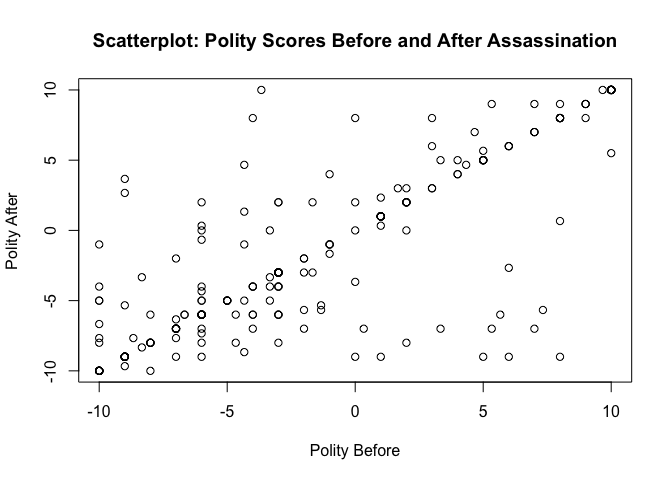
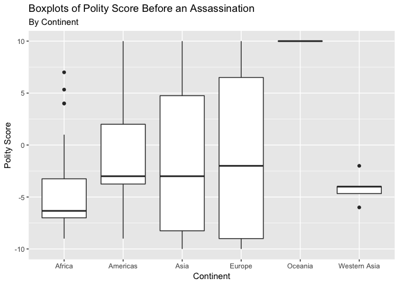
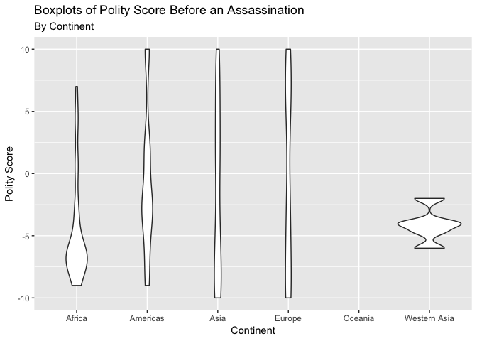
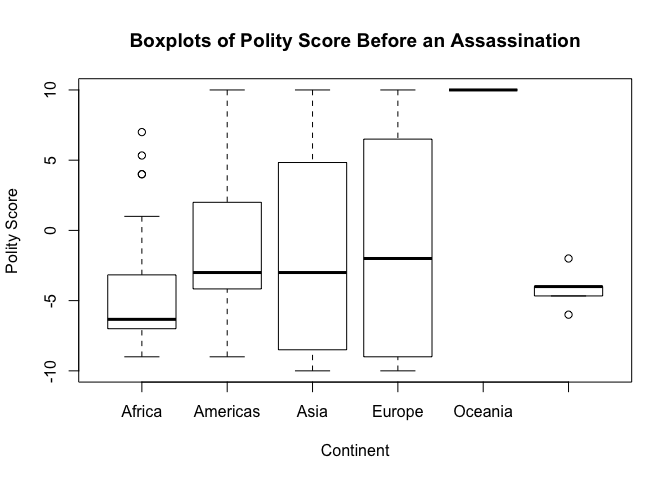
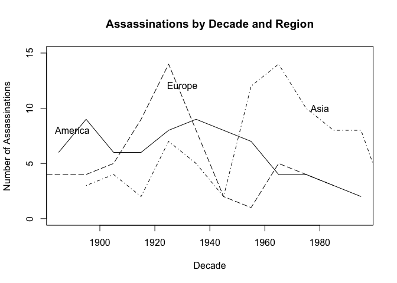
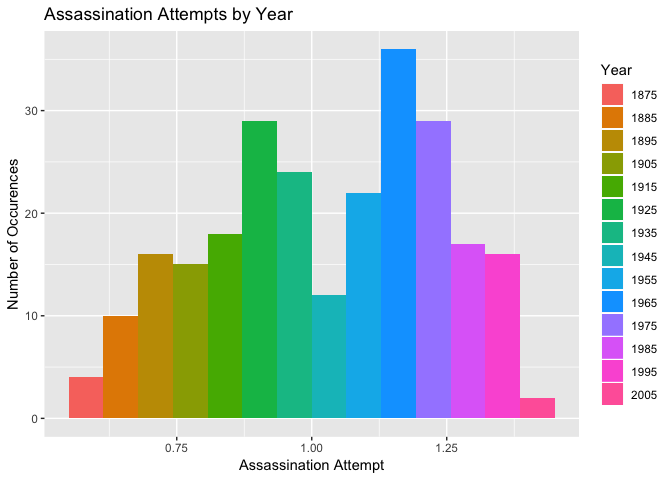
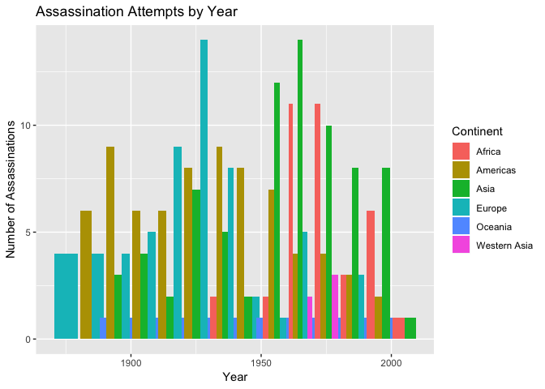

Plots, Timeseries, and More Fun Coding
================
Marie Fester
2019-02-18

Load the packages & datasets

``` r
# p_load is a function in the pacman package which installs a package if haven't already and 
# then calls it using the library() function
pacman::p_load(ggplot2, dplyr, wesanderson)

leaders <- read.csv("leaders.csv")
leaders <- leaders[(1:250), (14:28)]
```

Data visualization using scatterplots
=====================================

Here, I plot polity scores before and after leader assassination attempts. I expect that in most countries the polity scores will change very little before and after.

``` r
# The ggplot argument takes the data you will use, mapping = aes() are the characteristics to use in the
# subsequent geoms (layers) of your graph
# I set color = result so that the dots will be colored based on the result of the assassination attempt
ggplot(data = leaders, mapping = aes(x = politybefore, y = polityafter, color = result)) +
# geom_point tells ggplot to make a scatterplot
  geom_point() +
# labs is used to assign titles; the defaults are variable names
  labs(title = "Scatterplot of Polity Score Before and After \n an Assassination Attempt",
       x = "Polity Score Before Attempt",
       y = "Polity Score After Attempt",
       color = "Result of Attempt")
```



Here we can see that, in most cases, polity score before and after an attempt are very similar; they are highly correlated. We can also see that the result doesn't seem to be related to the polity score.

In base r
---------

``` r
plot(x = leaders$politybefore, y = leaders$polityafter,
     main = "Scatterplot: Polity Scores Before and After Assassination",
     xlab = "Polity Before",
     ylab = "Polity After")
```



Correlation Coefficient ~ Use the cor function
==============================================

``` r
cor(x = leaders$politybefore, y = leaders$polityafter, use = "pairwise.complete.obs")
```

    ## [1] 0.8283237

Boxplots
========

Boxplots are used to understand data dispersion and represent summary statistics like mean, median, and quantile. \#\# Using ggplot

``` r
ggplot(data = leaders, aes(x = continent, y = politybefore, group = as.factor(continent))) +
  geom_boxplot() +
  labs(title = "Boxplots of Polity Score Before an Assassination", subtitle = "By Continent",
       x = "Continent", y = "Polity Score")
```



``` r
ggplot(data = leaders, aes(x = continent, y = politybefore, group = as.factor(continent))) +
  geom_violin() +
  labs(title = "Boxplots of Polity Score Before an Assassination", subtitle = "By Continent",
       x = "Continent", y = "Polity Score")
```



Using base r
------------

``` r
boxplot(formula = politybefore ~ continent, data = leaders, 
        main = "Boxplots of Polity Score Before an Assassination",
        xlab = "Continent", ylab = "Polity Score")
```



Timeseries data and data visualization
======================================

What is timeseries data?
------------------------

Timeseries data is data made up of observations from more than one year. For example, a dataset of Canadian GDP since 1950, would be a timeseries dataset. You may also encounter timeseries crossectional data, in such a case there are two characteristics which define a unique observation. A commonly used for of timeseries crossectional data is country-year data, for example the Polity datasets record democracy scores for all countries with unique observations each year.

What is the best way to represent timeseries data?
--------------------------------------------------

In a time series plot, the goal is to show the value of an observation over time. In order to show such a trend, you can use a histogram, line graph, or dot plot. These work because you can present multiple values in one graph.

How to make a timeseries plot
=============================

A timeseries plot using base r
------------------------------

In base r code, to make a line graph, we use the plot() function.

### Step 1, Clean up the data

``` r
# Since there are many values for an assassination attempt, I create a new dummy variable
leaders$dummy <- ifelse(leaders$result == "dies between a day and a week"| 
                                 leaders$result =="dies between a week and a month"| 
                                 leaders$result == "dies within a day after the attack"|
                                 leaders$result == "dies, timing unknown"|
                                 leaders$result == "hospitalization but no permanent disability"|
                                 leaders$result == "not wounded"|
                                 leaders$result == "plot stopped"|
                                 leaders$result == "survives but wounded severely"|
                                 leaders$result == "survives, whether wounded unknown"|
                                   leaders$result == "wounded lightly", 1, 0)

year.range <- max(leaders$year) - min(leaders$year)
year.range
```

    ## [1] 123

### Create region subsets to plot on same graph

``` r
americas <- subset(leaders, leaders$continent == "Americas")

asia <- subset(leaders, leaders$continent == "Asia"|
                                leaders$region ==  "Western Asia")

europe <- subset(leaders, leaders$continent == "Europe")

# These next lines creates lists with name = year and the value = number of assassination attempts
americas.assassinations <- tapply(americas$dummy, americas$decade, sum)

asia.assassinations <- tapply(asia$dummy, asia$decade, sum)

europe.assassinations <- tapply(europe$dummy, europe$decade, sum)
```

### Plot the subsets using the plot function

``` r
# The first layer; choose one subset to plot
plot(x = names(americas.assassinations), y = americas.assassinations, col = "black", type = "l",
     ylim = c(0, 15),
# The next three lines add titles
     main = "Assassinations by Decade and Region",
     xlab = "Decade",
     ylab = "Number of Assassinations")
# Add layers to the plot; you can change the line type (lty) to differentiate the regions
lines(names(asia.assassinations), asia.assassinations, lty = "dotdash", type = "l")
lines(names(europe.assassinations), europe.assassinations, lty = "longdash", type = "l")
# Add text layers to the plot to identify each region
# Run the plot first to get a rough idea of where to place your text
text(1980, 10, "Asia")
text(1930, 12, "Europe")
text(1890, 8, "America")
```



A timeseries plot using ggplot2
-------------------------------

### A bar plot

``` r
ggplot(data = leaders, mapping = aes(x = leaders$dummy, 
                                     fill = as.factor(decade))) +
  geom_bar(position = "dodge") + 
  labs(title = "Assassination Attempts by Year", x = "Assassination Attempt", 
       y = "Number of Occurences", fill = "Year")
```



### A bar plot 2.0

Since every observation is an assassination attempt, we can get ggplot to count the number of observations per year. We want the color to be for continent. Since continent is a *discrete* variable we use the as.factor argument. We call fill = as.factor(continent).

``` r
ggplot(data = leaders, mapping = aes(x = leaders$decade, 
                                     fill = as.factor(continent))) +
  geom_bar(position = "dodge") + 
  labs(title = "Assassination Attempts by Year", x = "Year", 
       y = "Number of Assassinations", fill = "Continent")
```

    ## Warning: position_dodge requires non-overlapping x intervals


