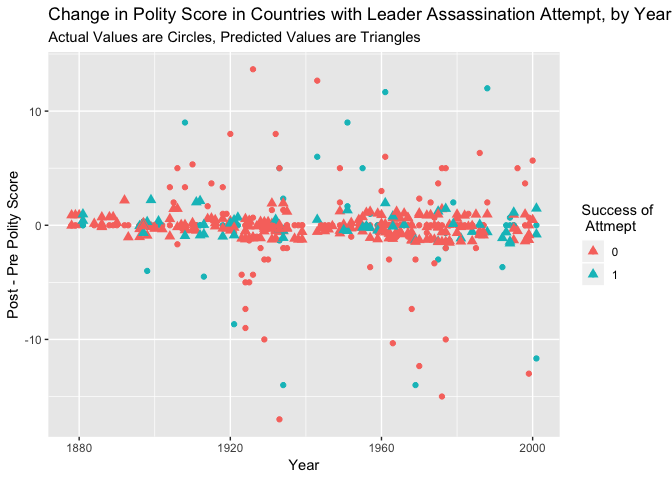

Regression and Predicted Values
================
Marie Fester
2019-03-11

``` r
pacman::p_load(ggplot2, dplyr, wesanderson, texreg)

leaders <- read.csv("leaders.csv")
```

Recoding
========

Here I make a new variable called success, 1 indicates that the assassination was success (leader dies), and 0 means the attempt was not successful. Then I make a variable which is the difference between the polity scores before and after assassination attempts.

``` r
leaders$success <- ifelse(leaders$result == "dies between a day and a week"| 
                                 leaders$result =="dies between a week and a month"| 
                                 leaders$result == "dies within a day after the attack"|
                                 leaders$result == "dies, timing unknown", 1, 0)

leaders <- mutate(leaders, diff = polityafter - politybefore)
```

Regression
==========

We can consider the hypothesis that a successful assassination will lead to a better polity score. Essentially, bad leaders are assassinated and replaced with new, better regimes. The base model predicts the difference in polity score before and after the attempt using the success variable. We can then add age of the ruler, and last we can add an interaction term between success and age of ruler.

``` r
# Use the lm function to do a regression
# Place one variable on the left of the ~, it is your outcome or dependent variables
# The variables to the right are the independent variables; they predict the outcome variable 
model1 <- lm(diff ~ success, data = leaders)
model2 <- lm(diff ~ success + age, data = leaders)
model3 <- lm(diff ~ success * age + region + decade, data = leaders)

# Two different ways to visualize your regression

# screenreg() is a function from the texreg package; it is useful for showing multiple models that use
# the same outcome variable
screenreg(list(model1, model2, model3), custom.model.names = c("Basic Model", "Model 2", "Full Model"))
```

    ## 
    ## ==========================================================
    ##                           Basic Model  Model 2  Full Model
    ## ----------------------------------------------------------
    ## (Intercept)                -0.15        -1.30    11.12    
    ##                            (0.27)       (1.10)  (19.73)   
    ## success                     0.09         0.01    -0.03    
    ##                            (0.59)       (0.59)   (3.68)   
    ## age                                      0.02     0.01    
    ##                                         (0.02)   (0.03)   
    ## regionCaribbean                                   1.79    
    ##                                                  (3.17)   
    ## regionCentral America                            -0.21    
    ##                                                  (2.88)   
    ## regionCentral Asia                                0.21    
    ##                                                  (4.81)   
    ## regionEastern Africa                             -1.29    
    ##                                                  (3.06)   
    ## regionEastern Asia                                0.09    
    ##                                                  (2.91)   
    ## regionEastern Europe                              0.40    
    ##                                                  (2.96)   
    ## regionMiddle Africa                               1.62    
    ##                                                  (3.62)   
    ## regionNorthern Africa                            -1.12    
    ##                                                  (3.00)   
    ## regionNorthern America                           -0.05    
    ##                                                  (3.07)   
    ## regionNorthern Europe                             0.11    
    ##                                                  (3.94)   
    ## regionSouth America                              -0.44    
    ##                                                  (2.86)   
    ## regionSouth-Eastern Asia                         -1.09    
    ##                                                  (3.14)   
    ## regionSouthern Africa                            -0.06    
    ##                                                  (3.93)   
    ## regionSouthern Asia                              -0.58    
    ##                                                  (2.88)   
    ## regionSouthern Europe                            -1.22    
    ##                                                  (2.90)   
    ## regionWestern Africa                              0.70    
    ##                                                  (3.06)   
    ## regionWestern Asia                                1.11    
    ##                                                  (2.88)   
    ## regionWestern Europe                             -0.64    
    ##                                                  (2.93)   
    ## decade                                           -0.01    
    ##                                                  (0.01)   
    ## success:age                                       0.00    
    ##                                                  (0.06)   
    ## ----------------------------------------------------------
    ## R^2                         0.00         0.00     0.05    
    ## Adj. R^2                   -0.00        -0.00    -0.05    
    ## Num. obs.                 250          250      245       
    ## RMSE                        3.81         3.81     3.90    
    ## ==========================================================
    ## *** p < 0.001, ** p < 0.01, * p < 0.05

``` r
# summary calls all the information
# Estimate is the effect of the independent variable on the dependent variable
# Standard deviation is the distance from the estimate approcximately 50% of observations are within

summary(model2)
```

    ## 
    ## Call:
    ## lm(formula = diff ~ success + age, data = leaders)
    ## 
    ## Residuals:
    ##      Min       1Q   Median       3Q      Max 
    ## -16.8114  -0.2277   0.1217   0.4924  13.9203 
    ## 
    ## Coefficients:
    ##             Estimate Std. Error t value Pr(>|t|)
    ## (Intercept) -1.29524    1.09940  -1.178    0.240
    ## success      0.01137    0.59004   0.019    0.985
    ## age          0.02170    0.02021   1.074    0.284
    ## 
    ## Residual standard error: 3.807 on 247 degrees of freedom
    ## Multiple R-squared:  0.004748,   Adjusted R-squared:  -0.003311 
    ## F-statistic: 0.5891 on 2 and 247 DF,  p-value: 0.5556

None of the independent variables have statistically signficant effects on the change in polity scores before and after an assasination attempt.

What about model fit? The adjusted r-squared is very low, which means that not much is being explained by the model. The residual standard error is low which is good, however, in this instance it is likely because there is little variation in pre and post assassination attempt values.

A quick note on factor variables. In this regression we used the category region as a variable, how does r calculate the effect of region? It compares each category to a base category, it chooses the default based on alphabetical order. In each case, the region is compared to Australia and New Zealand.

Predicted Values
================

``` r
# We add three new columsn to the leaders dataset, for the estimate, and the lower and upper bounds
# of the confidence interval (based on the standard deviation)
# we use the predict function, calling the model, then the dataset to draw values from
# set interval = confidence; the default is the 95% confidence interval
leaders[, c("fit", "lwr", "upr")] <- predict(model3, leaders, interval = "confidence")
```

Plot 'em
--------

Next up we want to visualize the predicted values, I show an example here in ggplot, but you can also use base r to plot them. For more examples of plots, check out the last tutoring handout on timeseries and histograms.

``` r
# The first layer plots the actual values
ggplot(leaders, aes(x = year, y = diff, color = as.factor(success))) + geom_point() +
  labs(title = "Change in Polity Score in Countries with Leader Assassination Attempt, by Year",
       x = "Year", y = "Post - Pre Polity Score", color = "Success of \n Attmept", 
       subtitle = "Actual Values are Circles, Predicted Values are Triangles") +
# here I add another layer of geom_point, I set inherit.aes = FALSE so that it does not use the same 
# aesthetics as it did in the first layer, I give the points a different shape to see the difference
# between our predicted and actual data
  geom_point(inherit.aes = FALSE, data = leaders, 
             mapping = aes(x = year, y = fit, color = as.factor(success)), shape = 17, size = 2.5)
```

    ## Warning: Removed 5 rows containing missing values (geom_point).



Overall, the data is clustered around 0, there are ibservation where the polity increase a lot and also ones with large derceases after an assassination attempt, no matter success. We see that success does seem to have an effect on polity scores; success is not sorted to either side of 0. There are many more unsuccessful attempts. The predicted values are less noisy; there is much less variation, this is because the predicted values are based on a model which makes estimates based on the average data point.
